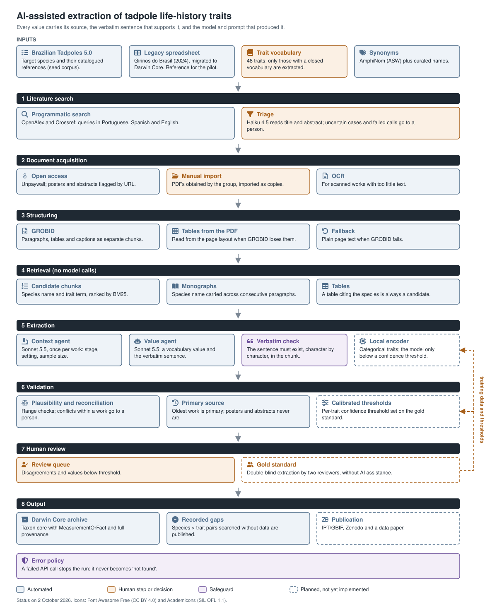

# tadpole_lifehistory_database

> **Resumo (pt-BR).** Base de *life history traits* de girinos do Brasil, em
> Darwin Core, e o pipeline de extração assistida por IA que a alimenta a
> partir da literatura. Cada valor extraído vem com a frase literal do artigo
> que o sustenta; valor sem frase é recusado, e a decisão final é humana.
> Estado em 02/10/2026: a planilha do livro está migrada e corrigida; o
> pipeline rodou de ponta a ponta e passou por um piloto em 4 obras. Plano e
> decisões em [`docs/proximos-passos.md`](docs/proximos-passos.md) e
> [`docs/piloto-zero.md`](docs/piloto-zero.md).

A Darwin Core database of life-history traits of Brazilian tadpoles, and the
AI-assisted pipeline that extracts those traits from the primary literature.
Every extracted value carries its source, the verbatim sentence that supports
it, and the model and prompt that produced it; a value without a verbatim
sentence is rejected, and final decisions are made by people.

Maintainer: Diogo B. Provete (UFMS), with Denise de C. Rossa-Feres and the
Brazilian Tadpoles 5.0 working group.

## Pipeline



The figure is generated by [`docs/figura_pipeline.R`](docs/figura_pipeline.R).
Dashed boxes are planned and not yet implemented. The design rationale is in
[`docs/desenho-do-pipeline.md`](docs/desenho-do-pipeline.md) (in Portuguese).

### Steps in more detail

**Inputs.** The target list comes from `species.json` of Brazilian Tadpoles
5.0, which also provides the references already catalogued for each species;
these enter as a seed corpus without triage. The legacy spreadsheet of
*Girinos do Brasil* (2024) was migrated to Darwin Core and corrected by
explicit rules, each correction logged; it is the reference for the pilot.
The trait vocabulary defines each trait's definition, unit, accepted values
and search terms before extraction. Synonyms come from the Amphibian Species
of the World via AmphiNom, plus curated names (some limited to a single
work); names that could point to another species go to review. Synonyms are
used to filter Crossref titles, in triage, in retrieval and in the
value-agent prompt; OpenAlex is queried with the accepted name only.

**1. Literature search.** OpenAlex (exact phrase in title, abstract and full
text) and Crossref (a record is kept only if the binomial is in its title),
with a record-type filter. A work with the binomial in its title is relevant
without a model call; otherwise a small model reads title and abstract, and
probabilities between 0.35 and 0.75, as well as failed calls, go to a person.

**2. Document acquisition.** Open-access PDFs come through Unpaywall, and a
download is kept only if it is a real PDF. Posters and conference abstracts
are flagged from the landing-page URL, because OpenAlex classifies some of
them as journal articles. Works without an open PDF are listed in a
spreadsheet, and the PDFs the group obtains are imported as copies, leaving
the originals untouched. There is no scraping of ResearchGate or
Academia.edu. Scanned works with too little text go through OCR.

**3. Structuring.** GROBID splits each PDF into paragraphs, tables and
captions, kept in document order; subsections inherit the main heading
(e.g. Methods / Study area), because GROBID often returns a flattened
hierarchy. Each "Table N" caption also opens a table chunk read from the PDF
layout, since GROBID loses tables printed on landscape pages. If GROBID fails
or returns no body text, the page text of the PDF is used.

**4. Retrieval.** No model is called. Chunks that name the species (accepted
name, synonym or abbreviation) and a trait term are ranked by BM25, keeping
the top 4 per species × trait × work. In monographs, a species named in one
paragraph is carried to the next ones (up to 3) until another species of the
work appears. A table that cites the species always gets a slot among the
candidates.

**5. Extraction.** The context agent reads the Methods once per work (or, in
short notes without a Methods section, the passages citing Gosner or stage)
and returns developmental stage, setting and sample size; it escalates to a
stronger model when stage or setting is missing. The value agent returns a
value from the closed vocabulary and the verbatim sentence that supports it;
it never computes, converts or infers. Because the sentence is a required
field, a "not found" answer does not escalate; escalation happens only when
the call fails (0 of 573 calls in pilot zero). The verbatim check then
requires the sentence to exist, character by character, in the chunk; it is
the only automatic barrier against invented values. The planned local
encoder would classify categorical traits and pass to the language model
only the chunks below a calibrated confidence threshold.

**6. Validation.** Out-of-range values are flagged. Within a work, equal
values collapse into one record and conflicting ones go to a person. The
oldest work reporting a value is the primary source, and a citation inside
the supporting sentence marks a value as secondary; posters and conference
abstracts are never primary sources. Per-trait confidence thresholds will be
calibrated against the gold standard; a trait that does not reach the target
precision at any threshold will require full human review.

**7. Human review.** A review queue holds disagreements with the reference
and values below threshold. The planned gold standard is a double-blind
extraction by two reviewers, without AI assistance, so that measured
precision is not agreement between two models. Reviewed values will be used
to calibrate the thresholds and to train the local encoder.

**8. Output.** A Darwin Core archive (Taxon core with MeasurementOrFact), in
which each value records its source, verbatim sentence, model and prompt
version. Species × trait pairs that were searched without yielding data are
published as gaps (`lacunas.txt`) rather than left blank. Publication
through IPT/GBIF and Zenodo, with a data paper, is planned.

Across all steps, a failed API call stops the run; it is never recorded as
"not found".

The repository has two independent parts:

1. **Migration of the legacy spreadsheet** (`R/migrar_planilha.R`,
   `R/corrigir_planilha.R`): restructures the spreadsheet compiled for the
   book *Girinos do Brasil* (2024) into Darwin Core and applies rule-based
   corrections, each one logged cell by cell.
2. **Extraction pipeline** (`_targets.R` and `R/`): searches the literature,
   obtains the PDFs, extracts traits with language models and writes the
   Darwin Core archive. It runs in rounds, species by species.

## Current status (2 October 2026)

| component | status |
|---|---|
| Legacy spreadsheet | migrated and corrected: 376 taxa, 695 occurrences, 18,214 measurements; 37,915 corrections logged |
| Target list | Brazilian Tadpoles 5.1.1: 1,066 species, 676 with a described tadpole |
| Trait vocabulary | 48 traits; 2 with a closed vocabulary (`eyes_positioning`, `snout_shape_lv`) and released for extraction |
| Pipeline | run end to end on one species (*Physalaemus barrioi*): search, triage, acquisition, structuring, extraction, validation |
| Pilot zero | 4 works already extracted by hand, 276 species × trait pairs, three rounds (US$ 6.19 in total). 99% of pairs identical between two identical rounds. After reading tables from the PDF text, raw agreement with the spreadsheet rose from 57% to 67% for snout shape; for eye position it fell from 62% to 58% because eye direction was taken as a synonym, under revision. Disagreements under human adjudication |
| Gold standard | not yet built (double-blind, two reviewers) |
| Publication | planned: IPT/GBIF, Zenodo and a data paper |

Projected API cost to fill the remaining cells for the 676 described species
is about US$ 260 using only the references already catalogued in Brazilian
Tadpoles 5.0, and US$ 500–1,000 including new literature from the search; the
basis of the estimate is in [`docs/piloto-zero.md`](docs/piloto-zero.md). The
main bottleneck is access to the PDFs, not cost: only 64 of the 753 catalogued
works have a DOI.

## Repository structure

```
.
├── _targets.R                 pipeline orchestration ({targets})
├── config.yml                 endpoints, models per agent, thresholds, paths
├── CITATION.cff
├── LICENSE                    MIT (code)
├── R/
│   ├── carregar.R             loads the whole project in an R session
│   ├── db.R                   DuckDB schema
│   ├── lista_alvo.R           Brazilian Tadpoles species.json -> target list + seed corpus
│   ├── sinonimia.R            synonyms from AmphiNom tables + curated names
│   ├── busca.R                OpenAlex and Crossref search; landing-page URL
│   ├── triagem.R              relevance triage (binomial in title, else Claude Haiku)
│   ├── aquisicao.R            open-access download; manual PDF import
│   ├── parse.R                GROBID -> chunks (text, tables, captions); tables from the PDF text
│   ├── recuperacao.R          BM25 retrieval; species name carried across paragraphs
│   ├── agentes.R              context and value agents (ellmer) and escalation
│   ├── extracao.R             extraction per species x trait x work; verbatim check
│   ├── validacao.R            plausibility, reconciliation, primary source, thresholds
│   ├── revisao.R              gold standard and human review queue
│   ├── dwc.R                  Darwin Core output (Taxon + MeasurementOrFact)
│   ├── piloto_zero.R          pilot against the hand-extracted spreadsheet
│   ├── conferencia.R          human review spreadsheet for a pilot round
│   ├── migrar_planilha.R      legacy spreadsheet -> Darwin Core + audit
│   ├── corrigir_planilha.R    rule-based corrections of the spreadsheet
│   ├── diagnostico.R          verificar_infra(): checks before a run
│   └── fumaca.R, fumaca_busca.R   smoke tests (one PDF; one species)
├── inst/
│   ├── traits.csv             trait vocabulary (definitions, values, search terms)
│   ├── sinonimos.csv          curated synonyms, optionally limited to one work
│   ├── piloto_zero_obras.csv  pilot sources and their PDFs
│   └── ...                    correction and decision tables for the spreadsheet
├── tests/                     test suites, no API or GROBID calls
├── python/encoder.py          local multilingual encoder (not yet in use)
└── docs/
    ├── pipeline.svg           pipeline figure (generated by figura_pipeline.R)
    ├── icones/                icons used in the figure, with their licences
    ├── proximos-passos.md     status, open decisions and next steps
    ├── piloto-zero.md         pilot plan and results
    ├── desenho-do-pipeline.md design rationale
    └── infraestrutura.md      models, prices and GROBID
```

Not in the repository (see `.gitignore`): PDFs and GROBID output (copyrighted
full text), the spreadsheets and the DuckDB database (unpublished data of the
group), the Darwin Core archive, and API keys.

## Getting started

```r
# load the project in an R session
source("R/carregar.R"); carregar_projeto()

# check packages, API key, models and GROBID (makes one minimal call per model)
source("R/diagnostico.R"); verificar_infra()

# run the pipeline
targets::tar_make()
```

Tests (no API calls, no GROBID):

```bash
for t in tests/teste_*.R; do Rscript "$t" || echo "FAILED: $t"; done
```

## Requirements

- R ≥ 4.2 with `targets`, `config`, `DBI`, `duckdb`, `dplyr`, `purrr`,
  `stringr`, `tidyr`, `httr2`, `xml2`, `readr`, `readxl`, `writexl`,
  `jsonlite`, `digest`, `ellmer`, `rlang`, `curl` and `pdftools`; optionally
  `cld3`, and `openxlsx2` to write the human review spreadsheet.
- `AmphiNom` for synonyms: `remotes::install_github("hcliedtke/AmphiNom")`.
- GROBID in Docker:
  `docker run --rm --init --ulimit core=0 -p 8070:8070 grobid/grobid:0.9.1-crf`.
- An Anthropic API key in `~/.Renviron` (`ANTHROPIC_API_KEY`), never in
  `config.yml` or in the code.

## Use of AI

Language models are used in the pipeline to triage the literature and to
extract trait values, always with the verbatim sentence from the source and
under human review. Code and documentation in this repository were written
with the assistance of Claude (Anthropic); commits made with it carry a
`Co-Authored-By` line. This follows the COPE position on AI tools and the
CNPq/CAPES guidelines.

## License

The **code** is released under the MIT License (see [`LICENSE`](LICENSE)).

The **data** are not in this repository. The Darwin Core archive will be
published separately, through IPT/GBIF and Zenodo, with its own license and
citation. The articles used as sources remain under their publishers'
copyright; for each value, only the verbatim sentence that supports it is
kept, together with its source.

## Citation

See [`CITATION.cff`](CITATION.cff).
